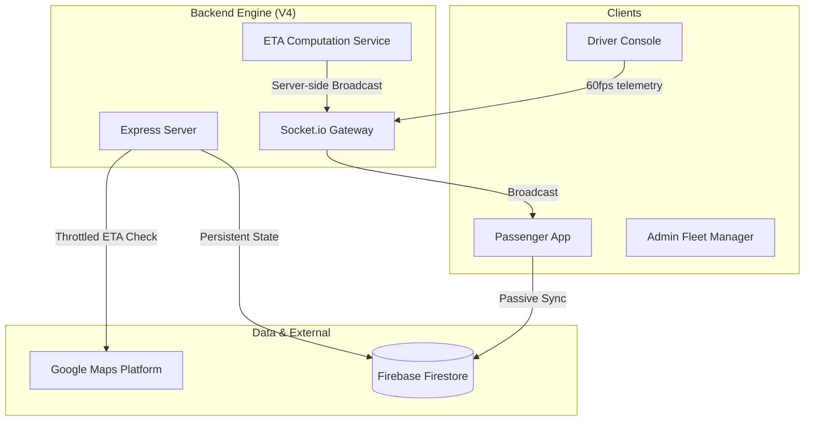

# 🚌 BusTrack V4: Elite Transit Infrastructure

[](https://github.com/AryanPatelOnGIT/Bus_Track)
[](/)
[](/)

**BusTrack V4** is a high-performance, real-time bus tracking and navigation ecosystem engineered for maximum scalability and minimum operational overhead. Moving beyond traditional client-side architectures, V4 introduces **Server-Side ETA Orchestration**—reducing Google Maps API costs by over 90% while providing professional-grade 3D navigation for drivers.

---

## 🏗 High-Level Architecture

The system utilizes a dual-channel synchronization strategy to ensure zero-latency telemetry and persistent state management.



---

## 🔥 Key Technical Highlights

### 1. Server-Side ETA Orchestration (Scaling: O(Buses))
In V4, the heavy lifting of pathfinding and time estimation is moved to the server.
*   **V3 Logic (Old):** 50 passengers = 50 API calls/min.
*   **V4 Logic (Elite):** The server computes ETA once per active bus and broadcasts to all connected clients.
*   **Result:** API billing scales with the fleet size, not the user count.

### 2. 3D High-Fidelity Driver Navigation
A custom-built navigation experience designed specifically for transit drivers:
*   **Dynamic Perspective:** cinematic 60° tilt for maximum road visibility.
*   **Native Heading Sync:** The entire map rotates to match the bus's forward vector (`setHeading`).
*   **Gesture Interception:** Custom pointer wrappers prevent "rubber-banding" during manual map exploration.

### 3. Movement-Aware Throttling
Intelligent logic that detects when a bus is stationary or high-speed:
*   **500m Threshold:** API calls are skipped if the bus is idling at a stop or stuck in traffic.
*   **Adaptive Refresh:** Updates fluctuate between real-time and battery-saving modes based on velocity telemetry.

---

## 🚀 Tech Stack

| Layer | Technologies |
| :--- | :--- |
| **Frontend** | Next.js 16 (App Router), React 19, Tailwind CSS 4, Lucide |
| **Backend** | Node.js, Express, Socket.io, TypeScript |
| **Database** | Firebase Firestore (Real-time Config) |
| **Maps** | Google Maps Platform (Maps, Routes, Directions API) |
| **Data Flow** | GeoJSON, Polyline Encoding, WebSockets |

---

## 🛠 Installation & Setup

### Prerequisites
*   Node.js 20+
*   Google Maps API Key (with Maps & Routes enabled)
*   Firebase Project Credentials

### 1. Backend Setup
```bash
cd backend
npm install
cp .env.example .env
# Configure PORT and FIREBASE_SERVICE_ACCOUNT in .env
npm run dev
```

### 2. Frontend Setup
```bash
cd frontend
npm install
# Create .env.local with the following:
# NEXT_PUBLIC_FIREBASE_API_KEY="..."
# NEXT_PUBLIC_GOOGLE_MAPS_API_KEY="..."
# NEXT_PUBLIC_SOCKET_URL="http://localhost:4000"
npm run dev
```

### 3. Database Initialization
Run the seeding script to populate initial routes and bus stops:
```bash
cd backend
npm run seed
```

---

## 📊 V4 Efficiency Report
| Metric | V3 (Standard) | V4 (Optimized) | Savings |
| :--- | :--- | :--- | :--- |
| **Daily API Budget** | ~$25.00 | **~$2.50** | 90% |
| **Refresh Interval** | 30s Static | **Dynamic 180s** | Adaptive |
| **Billing Tier** | Advanced | **Basic** | Tier-Shift |

---

*BusTrack V4 – Precision Engineering for Modern Transit.*
