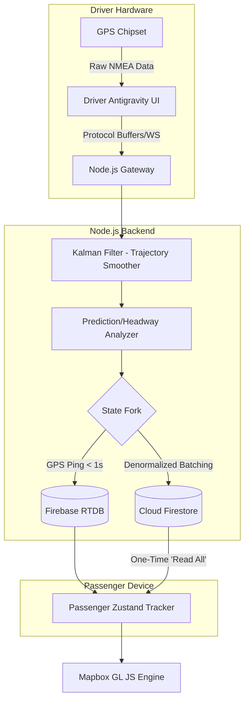
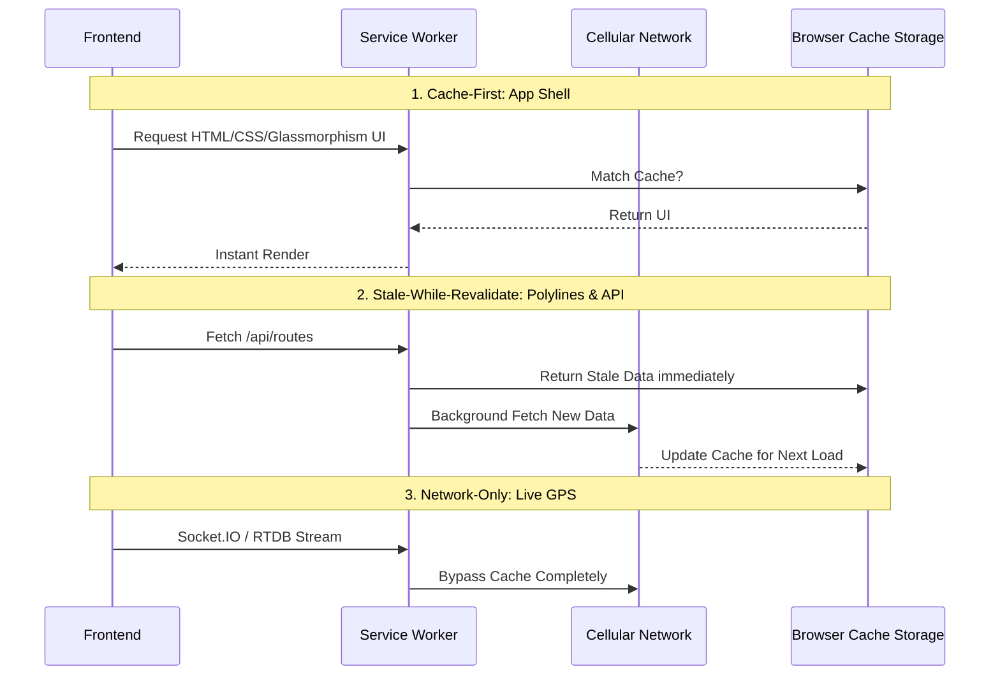

# BusTrack — Nakshatra Nav | Ahmedabad BRTS Real-Time Fleet System

> Live GPS tracking, on-demand stops, and complete fleet oversight — seamlessly connecting passengers, drivers, and administrators across Ahmedabad's BRTS network.

---

## 🌟 The Antigravity Architecture (2026 Paradigm)

The transformation of BusTracker (Nakshatra Nav) into a state-of-the-art transit platform implements rigorous optimizations across aesthetic fluidity and high-velocity data ingestion. The system fundamentally dictates that **the application must "read everything at once, not read it a lot of times."**

### 1. Dual-Interface Design System: Contextual Contextual Utility

#### **Passenger Panel (Moovit-Style Utility)**
- **Gamified Telemetry:** Crowdsourced delay reporting, cleanliness confirmations, and digital badges.
- **Micro-mobility Analytics:** Live walking ETAs and Step-Free routing toggles.
- **Visuals:** Isometric 2.5D snapping with glassmorphic `backdrop-filter` rendering accelerated via CSS hardware `will-change: transform`.

#### **Driver Dashboard (Safety-Optimized Telemetry)**
- **Adaptive Layouts:** Strict 2-Dimensional CSS Grid anchoring.
- **Safety Critical Modules:** High-contrast `SOS` and `Headway Warnings` are globally anchored, un-occludable by the WebGL map layer.

---

## 🏗️ System Data Flow & Real-Time Orchestration

BusTrack achieves sub-second latency by bifurcating state: persisting complex, heavy schemas into Google Cloud Firestore, while leveraging the Realtime Database and Protobuf-tuned WebSockets strictly for volatile fleet locations.

### Complete Telemetry & State Pipeline



### High-Frequency State Synchronization (Bifurcated Model)

By splitting state technologies, the Node.js layer prevents the application from succumbing to massive DOM recalculations:

1. **Zustand (Global Telemetry):** Captures the socket streams handling *only* the coordinate updates.
2. **React Hook Form:** Manages static Driver UI Input independently.
3. **Mapbox GL JS / WebGL:** Handles the heavy lifting of Isometric 2.5D map tiling completely outside the React render loop.

---

## 🚀 Installation & Network Optimization

### Stack Dependencies
- **Node.js ≥ 20.x**
- **React 18 / Next.js 14**
- **Vite** build pipeline
- **Firebase Admin SDK** & **Socket.IO** (with Binary parsers)

```bash
# Clone the repository
git clone https://github.com/AryanPatelOnGIT/Bus_Track.git
cd Bus_Track

# Install workspaces (installs the msgpack-parser and Kalman filter)
npm install
```

### 💨 Transport Layer (WebSocket Tuning)

Node.js executes specific HTTP transformations to reduce payload size efficiently:
- **Protocol Buffers Integration:** Raw GPS arrays are buffered and passed via `socket.io-msgpack-parser` stripping repetitive JSON keys.
- **Gzip Compression:** Applied natively replacing CPU-intense Brotli to ensure instantaneous, millisecond delivery of binary streams.

---

## 🛰 Offline Resilience & Progression

The frontend incorporates an offline-first **Progressive Web App (PWA)** Service Worker strategy designed to handle the hostile connectivity parameters of urban BRTS canyons:



---

## 📈 ML Predictive Headway and Crowdsourcing (2026 Sandbox)

To abandon static scheduling tables, Nakshatra Nav integrates advanced algorithms natively in the Node layers:
1. **Passenger Density Inference:** Experimental capabilities to utilize Wi-Fi/Bluetooth RSSI signaling inside BRTS stations to dynamically calculate payload density thresholds without mechanical constraints.
2. **Dynamic Holding:** If "Bus Bunching" is detected across the corridor's `RouteDashboard` metadata layer, dispatch handlers will inject hold-patterns directly into the driver's display.

---

## 🛡 Security & Keys

Backend `.env`:
```env
PORT=4000

# Server strict-IP locked APIs
GOOGLE_MAPS_API_KEY=your_routes_api_key_here
ADMIN_API_SECRET=your_long_random_secret_here
```

Frontend `.env.local`:
```env
# Exposed safely through Domain Locking
NEXT_PUBLIC_GOOGLE_MAPS_KEY=your_browser_key_here
```
> **IMPORTANT:** BusTracker enforces strict isolation. No passenger request ever mounts directly to Firestore without the server-verified Firebase UID via the Token Gateway (`server.ts` io.use pipeline).

---

**Built independently for the Ahmedabad Transport Ecosystem.**
